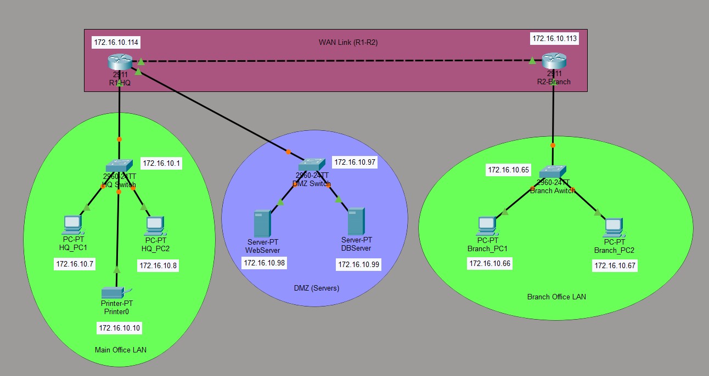
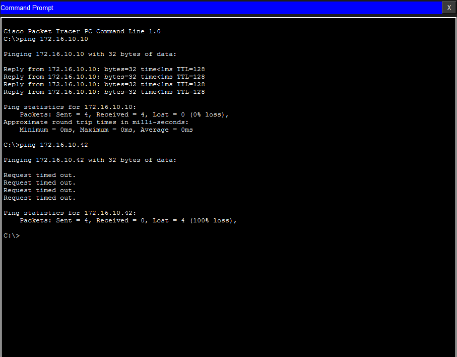

# SecureBooks Inc. – Enterprise Network Design using VLSM

## 📘 Project Overview

This repository presents a complete **enterprise-level network design and implementation** for **SecureBooks Inc.**, developed as part of a **Computer Networks semester project** using **Cisco Packet Tracer**.

The network simulates a real corporate environment consisting of a **Main Office**, a **secured DMZ**, and a **Branch Office**, all interconnected via a **WAN link**. The entire infrastructure operates under a **single IPv4 address block (172.16.10.0/24)**, efficiently divided using **Variable Length Subnet Masking (VLSM)**.

The project demonstrates practical application of **routing protocols, subnetting, and access control mechanisms** aligned with real-world enterprise networking standards.

---

## 🎯 Project Objectives

- Design a scalable enterprise network using **VLSM**
- Optimize IP address utilization under a single `/24` block
- Implement **mixed routing protocols** (RIP v2, Static, Default)
- Deploy a **DMZ-based security architecture**
- Enforce **security policies using Extended ACLs**
- Simulate realistic corporate network communication and isolation

---

## 🏗 Network Architecture

The enterprise network is divided into the following logical segments:

| Segment | Description |
|------|------------|
| Main Office LAN | Internal corporate users and printer |
| DMZ | Web Server and Database Server |
| Branch Office LAN | Remote office users |
| WAN Link | Point-to-point connectivity between HQ and Branch |

### 🔷 Network Topology

---

## 🌐 IP Addressing Plan (VLSM)

The address block **172.16.10.0/24** is subnetted using VLSM as follows:

| Network Segment | Subnet | Usable IP Range | Purpose |
|----------------|--------|----------------|---------|
| Main Office LAN | 172.16.10.0/26 | 172.16.10.1 – 172.16.10.62 | HQ users |
| Branch Office LAN | 172.16.10.64/27 | 172.16.10.65 – 172.16.10.94 | Branch users |
| DMZ | 172.16.10.96/28 | 172.16.10.97 – 172.16.10.110 | Servers |
| WAN Link | 172.16.10.112/30 | 172.16.10.113 – 172.16.10.114 | Router link |

---

## 🔁 Routing Strategy

To reflect enterprise practices, multiple routing methods are used:

### Dynamic Routing – RIP v2
- Enabled between HQ and Branch routers
- Advertises LAN and WAN networks
- Simplifies route exchange in a small-to-medium network

### Static Routing – DMZ
- Configured on HQ router
- Ensures controlled and predictable access to servers
- DMZ routes are not advertised via RIP

### Default Routing – Branch Router
- Branch router forwards unknown traffic to HQ
- Reduces routing complexity at the branch level

---

## 🔐 Security Implementation (Extended ACLs)

Security is enforced using **Extended Access Control Lists (ACLs)** applied on the HQ router to protect the DMZ.

### Access Control Policy

| Rule | Source | Destination | Action |
|-----|--------|------------|--------|
| A | HQ & Branch | Web Server | Permit |
| B | HQ only | Database Server | Permit |
| C | Branch | Database Server | Deny |

This ensures:
- Branch users can access **only the Web Server**
- Database Server remains protected from Branch access
- Internal HQ users retain full access

---

## ⚙ Device Configuration

### Configuration Summary
- Routers configured with VLSM-based IPs
- RIP v2 enabled where required
- Static and default routes applied
- Extended ACLs implemented for DMZ security
- Servers assigned static IP addresses
- Main Office hosts use DHCP

---

## 🧪 Testing & Verification

The network was validated using:

- Ping tests across all segments
- Traceroute to verify routing paths
- `show ip route` on both routers
- DHCP lease verification
- ACL hit-count validation
- Explicit testing of allowed and denied traffic

All tests confirmed correct routing, connectivity, and security enforcement.

---

## 📂 Project Files & Resources

- 📡 **[Cisco Packet Tracer File](https://github.com/MH4S33B/VLSM-Network-Design/blob/main/Cisco%20Packet%20Tracer%20VLSM.pkt)**  
  

- 📊 **[Project Presentation](https://github.com/MH4S33B/VLSM-Network-Design/blob/main/VLSM%20Presentation.pptx)**  
  

- 📄 **[Detailed Project Report](https://github.com/MH4S33B/VLSM-Network-Design/blob/main/VLSM%20Report.pdf)**  
  

---

## 🚀 Future Enhancements

- VLAN-based departmental segmentation
- Inter-VLAN routing
- Site-to-site VPN implementation
- IDS/IPS simulation
- SNMP and Syslog monitoring
- Network automation using Python or Ansible
- Server redundancy and load balancing

---

## 📌 Conclusion

This project demonstrates a **professional enterprise network design** implementing **VLSM**, **DMZ security**, **routing optimization**, and **ACL-based access control**. The design follows industry best practices and serves as a strong foundation for advanced networking and cybersecurity implementations.

---

## 👨‍💻 Authors

- **[Muhammad Haseeb](https://www.linkedin.com/in/mhaseeb211/)**  
- **[Ahmed Saleem](https://www.linkedin.com/in/ahmad-saleem-23870b351/)**  
- **Syed Ahtesham**

**Course:** Computer Networks  
**Instructor:** [Miss Maila Zahra](https://www.linkedin.com/in/mailazahra/)
